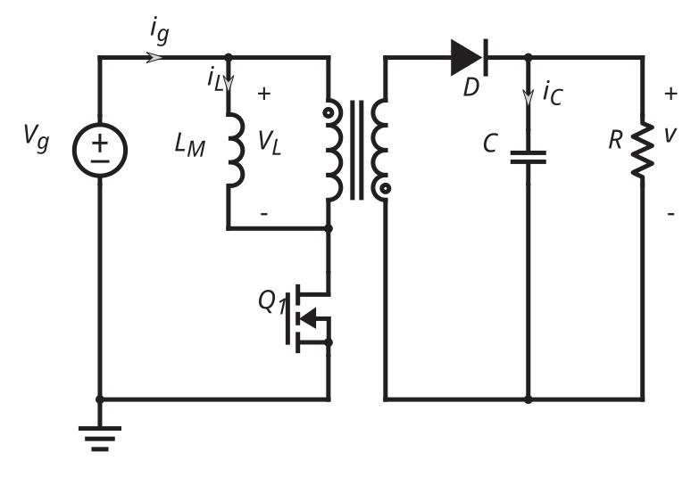

The following circuit is converter type BUCK-BOOST running in DCM mode.

```{python}
#|echo: false 
#|output: true
from contextlib import redirect_stdout, redirect_stderr
import io
import warnings
import logging
from lcapy import *

warnings.filterwarnings('ignore')
logging.getLogger('lcapy').setLevel(logging.ERROR)
with redirect_stdout(io.StringIO()), redirect_stderr(io.StringIO()):
    converter_P2 = Circuit(r"""
    #create voltage source
        V ._plus  0 {V_g  }; down, size=2
    #create inductor
        L ._1 ._2; down, l= L, size=2, i>^=i(t)
    #create diode
        D ._A ._K; left, l= D, size=2
    #create capacitor
        C ._1 ._2; down, l= C, size=2
    #create resistor
        R ._1 ._2; down, l= R, size=2, v=V
    #create transistor-NMOS
        M ._D ._G ._S nmos; up, l= Q1, size=2
    #create connections:
    # connect voltage source to transistor
        W V._plus M._D; right, size=1
    # connect transistor to inductor
        W M._S L._1; steps=-|, free
    # connect transistor to diode
        W M._S D._K; right, size=0
    # connect diode to capacitor
        W D._A C._1; steps=-|, free
    # connect diode to resistor
        W D._A R._1; steps=--|, free
    # connecting grounds
        #ground inductor
        W 0 L._2; right, size=3
        #ground capacitor
        W L._2 C._2; right, size=2
        #ground resistor
        W C._2 R._2; right
        ; autoground=false, draw_nodes=connections, label_ids=false, label_nodes=alpha, european voltages""")
    converter_P2.draw()
```

-   All the elements are ideal.
-   All the losses are neglected.
-   The transistor is conduction at time interval $\left[0, D_{1}T_{s}\right]$.
-   DCM mode.

## Question A:

What is the condition for the converter to operate in DCM mode? 

::: {.callout-note}
## The work principles of the converter for DCM mode are as follows:

* The voltages and currents in the system are periodic waves with period $T_{s}$, as result of that:
    * The average voltage across the inductor in one period is zero.
    * The average current through the capacitor in one period is zero.
* The following connections between the the temporal waveforms and their average over period for all waves (voltages and currents):
    $$ \int_{0}^{T_{s}} x\left(\tau \right)d\tau = T_{s} \cdot X = \int_{0}^{T_{s}}X d\tau$$

    in addition to that, for capacitor voltages (assuming small ripple):

    $$
    \begin{gathered}
    \int_{0}^{D_{1}T_{s}} v\left(\tau\right)d\tau \approx D_{1}T_{s} \cdot V \\
    \int_{D_{1}T_{s}}^{\left(D_{1}+D_{2}\right)}v\left(\tau\right)d\tau \approx D_{2}T_{s} \cdot V \\
    \int_{D_{2}T_{s}}^{\left(D_{2}+D_{3}\right)T_{s}} v\left(\tau\right)d\tau \approx D_{3}T_{s} \cdot V
    \end{gathered}
    $$

:::

First, I'll analyze the converter in CCM mode, for that, I'll represent an equivalent schematic with transformer:



